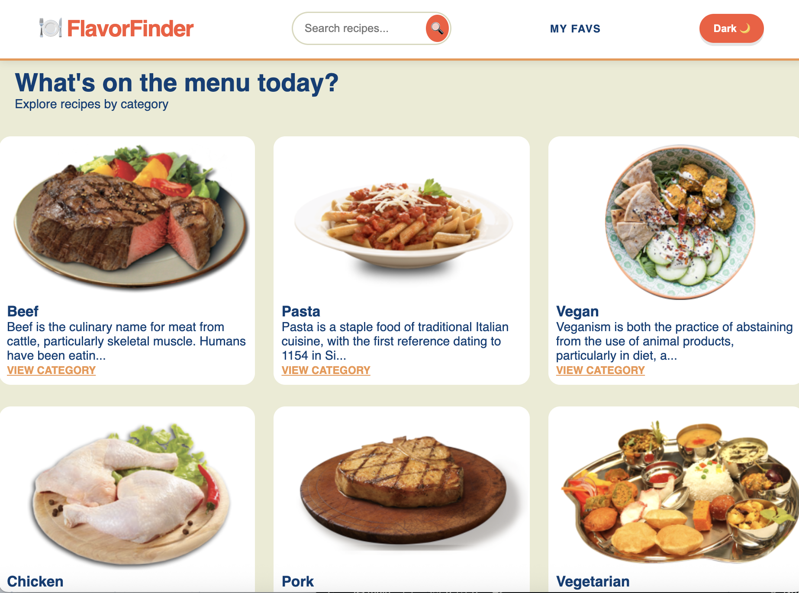

# 🍳 Recipe Discovery App (React + TypeScript)
A modern, responsive web application for exploring culinary inspirations. This project was built to practice state management, custom hooks, and handling asynchronous data flows in a type-safe environment.

## 🚀 Getting Started
To get a local copy up and running, follow these steps:

**Navigate to the project directory:**
  ```bash
     cd recipe-discovery-app
   ```
**Install dependencies:**
```bash
  npm install
```
**Start the development server:**
```bash
   npm run dev
``` 
**View the app:** Open the LocalHost URL provided in your terminal.

## ✨ Features
**Browse Categories:** Explore recipe categories fetched directly from the API.

**Search & Filter:** Find specific dishes using the search input or filter by category.

**Detailed View:** Deep-dive into ingredients and instructions via React Router-powered pages.

**Favorites System:** Save and manage your favorite recipes in a dedicated list.

**Dark Mode:** Toggle between light and dark themes for a personalized UI experience.

## 🛠️ Technical Highlights
**Solving Race Conditions with Context**
During development, I encountered race conditions when the Context and Provider were bundled too tightly. This often led to components attempting to consume state before it was initialized.

**The Solution:** I decoupled the Context definition from the Provider component. By separating these into different files/modules, I ensured a predictable initialization order and cleaner imports, effectively eliminating the synchronization errors.

**🧱 Responsive Masonry Layout**
To display recipes of varying heights without awkward gaps, I implemented a Masonry Grid using CSS.This was my favorite part of the project as it gives a different feel.

**The Approach:** Instead of a standard grid-template-rows, I utilized grid-template-columns: repeat(auto-fill, minmax(250px, 1fr)) combined with grid-row: span [value].

## Key Tools Used
**Vite:** For a blazing-fast development environment.

**TypeScript:** To ensure type safety across API responses and component props.

**React Router:** For seamless client-side navigation.

**Custom Hooks:** To encapsulate logic for API calls and local storage management.


